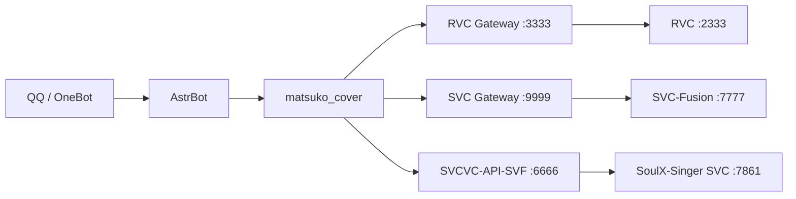

# astrbot_plugin_matsuko_cover

适用于 [AstrBot](https://github.com/AstrBotDevs/AstrBot) 的 AI 翻唱插件，支持 **RVC、SVC-Fusion、SoulX-SVCVC** 三种语音转换后端，以及网易云音乐、QQ 音乐、本地音频和 LLM 工具调用。

> 当前版本：**v2.7.1**
>
> 许可证：**GNU AGPL-3.0**
>
> 本项目基于 [CCYellowStar2/astrbot_plugin_rvc_svc](https://github.com/CCYellowStar2/astrbot_plugin_rvc_svc) 扩展。

## 功能

| 功能 | RVC | SVC-Fusion | SoulX-SVCVC |
|---|:---:|:---:|:---:|
| 网易云 / QQ 音乐点歌 | ✅ | ✅ | ✅ |
| 本地音频翻唱 | ✅ | ✅ | ✅ |
| LLM 智能点歌 | ✅ | ✅ | ✅ |
| 模型/音色列表和别名 | ✅ | ✅ | ✅ |
| 自动升降调 | ✅ | ✅ | ✅ |
| 推理进度发送到 QQ | ✅ | ✅ | ✅ |
| 参数级结果缓存 | 由中间层提供 | 由中间层提供 | ✅ |
| 零样本参考音色 | ❌ | ❌ | ✅ |
| 固定/随机种子 | ❌ | ❌ | ✅ |

其他能力：

- 搜索、选歌、选模型、推理和发送结果的完整工作流。
- QQ 音乐风控重试与可选第三方 VIP 播放地址 API。
- RVC/SVC 的 F0、检索率、混响、延迟、人声/伴奏音量等参数。
- MSST 模型列表、默认分离模型切换和分离质量参数。
- 翻唱任务查询、取消、批量翻唱、用户偏好和统计。
- QQ 语音发送失败时自动继续尝试发送音频文件。

## 架构



插件负责聊天交互、歌曲搜索/下载、参数选择和结果发送；中间层负责人声分离、缓存、后处理及调用实际推理引擎。

## 安装

将仓库克隆到 AstrBot 的插件目录：

```bash
cd AstrBot/data/plugins
git clone https://github.com/sdfsfsk/matsuko_cover.git astrbot_plugin_matsuko_cover
pip install -r astrbot_plugin_matsuko_cover/requirements.txt
```

随后重启 AstrBot，并在 WebUI 的插件配置中启用需要的后端。

依赖：

```text
gradio_client
aiohttp
qqmusic-api-python
```

## 后端准备

### 中间层源码下载

旧版 README 中的百度网盘整合包不再作为主要下载入口，请直接使用以下公开项目：

| 项目 | 人声分离 | GPU 后端 | 适合场景 |
|---|---|---|---|
| [RVCSVC-API-amd](https://github.com/sdfsfsk/RVCSVC-API-amd) | UVR5 / HP5 | DirectML | 环境较轻、兼容范围较广 |
| [RVCSVC-API-MSST](https://github.com/sdfsfsk/RVCSVC-API-MSST) | BS-Roformer / MSST | Windows AMD ROCm 7.2.1 | 更高分离质量、显存需求更高 |
| [SVCVC-API-SVF](https://github.com/sdfsfsk/SVCVC-API-SVF) | SoulX-Singer 内置分离 | 轻量中间层 + 上游 Windows AMD ROCm | 零样本参考音色转换 |

> [!CAUTION]
> **完整推理方案仅支持 Windows AMD 显卡（A 卡），NVIDIA、Intel GPU 和纯 CPU 环境不在支持范围内。** `RVCSVC-API-amd` 与 `RVCSVC-API-MSST` 使用相同的 3333/9999 端口，只需选择其中一个，不能同时启动；`SVCVC-API-SVF` 使用 6666 端口，可以与前两者之一同时运行，但还需要应用 AMD 补丁的 SoulX-Singer 上游。

公开仓库只包含源码和环境安装脚本，不包含已安装的 Python/ROCm 运行时、UVR5/MSST 权重、RVC/SVC/SoulX 模型、私人参考音色或歌曲缓存。请按照各项目 README 准备环境、上游引擎和分离模型。

### RVC

- 插件默认中间层：`http://127.0.0.1:3333/`
- 从 [RVCSVC-API-amd](https://github.com/sdfsfsk/RVCSVC-API-amd) 或 [RVCSVC-API-MSST](https://github.com/sdfsfsk/RVCSVC-API-MSST) 选择一个中间层。
- 启动 RVC 上游和所选中间层。
- 使用 `/刷新rvc模型` 读取模型列表。

### SVC-Fusion

- 插件默认中间层：`http://127.0.0.1:9999/`
- 从 [RVCSVC-API-amd](https://github.com/sdfsfsk/RVCSVC-API-amd) 或 [RVCSVC-API-MSST](https://github.com/sdfsfsk/RVCSVC-API-MSST) 选择一个中间层。
- 启动 SVC-Fusion 上游和所选中间层。
- 兼容补丁参考：[sdfsfsk/SVC-Fusion-fix](https://github.com/sdfsfsk/SVC-Fusion-fix)
- 使用 `/刷新svc模型` 读取模型列表。

### SoulX-SVCVC

SoulX-SVCVC 使用参考音频进行零样本音色转换，不需要训练 `.pth` 音色模型。

- 中间层：[sdfsfsk/SVCVC-API-SVF](https://github.com/sdfsfsk/SVCVC-API-SVF)
- Windows AMD ROCm 补丁：[sdfsfsk/SoulX-Singer-AMD-Patch](https://github.com/sdfsfsk/SoulX-Singer-AMD-Patch)
- 插件默认中间层：`http://127.0.0.1:6666/`
- SoulX-Singer SVC 上游：`http://127.0.0.1:7861/`

启动顺序：

1. 启动 SoulX-Singer，选择 `SVC voice conversion`，等待 7861 就绪。
2. 启动 SVCVC-API-SVF，等待 6666 就绪。
3. 在插件配置中开启 `enable_svcvc`。
4. 使用 `/刷新svcvc音色`。

参考音色放入 SVCVC-API-SVF 的 `voice_profiles/`。支持 WAV、FLAC、MP3、OGG、M4A 和 AAC；文件名默认作为音色 ID，也可添加同名 JSON：

```json
{
  "profile_id": "my_voice",
  "display_name": "示例音色",
  "description": "干净、无伴奏的参考演唱",
  "prompt_vocal_sep": false
}
```

建议使用 5～30 秒、单人、无伴奏、低混响的干净音频。新增音色后需要重启或刷新中间层的 Gradio 音色选项，再执行插件刷新命令。

## 常用配置

| 配置 | 默认值 | 说明 |
|---|---:|---|
| `rvc_base_url` | `http://127.0.0.1:3333/` | RVC 中间层 |
| `svc_base_url` | `http://127.0.0.1:9999/` | SVC-Fusion 中间层 |
| `svcvc_base_url` | `http://127.0.0.1:6666/` | SoulX-SVCVC 中间层 |
| `enable_rvc` | `true` | 启用 RVC |
| `enable_svc` | `true` | 启用 SVC-Fusion |
| `enable_svcvc` | `false` | 启用 SoulX-SVCVC |
| `enable_qqmusic` | `true` | 启用 QQ 音乐 |
| `disable_netease` | `false` | 禁用网易云点歌 |
| `enable_progress_bar` | `true` | 将后端进度发到聊天 |
| `progress_update_interval` | `3` | 进度消息最小间隔（秒） |
| `enable_send_file` | `false` | 除 QQ 语音外再发送文件 |
| `inference_timeout` | `300` | 推理超时（秒） |
| `llm_force_mode` | `false` | 禁用手动命令，只允许 LLM 工具 |

SoulX 在 AMD 上处理长歌曲时建议把 `inference_timeout` 和任务超时提高到 `9000` 秒。

### SoulX 参数

| 配置 | 默认值 | 说明 |
|---|---:|---|
| `svcvc_prompt_vocal_sep` | `false` | 是否分离参考音频 |
| `svcvc_target_vocal_sep` | `true` | 是否分离目标歌曲 |
| `svcvc_auto_shift` | `true` | 自动匹配音域 |
| `svcvc_auto_mix_acc` | `true` | 自动混回伴奏 |
| `svcvc_pitch_shift` | `0` | 指定变调，范围 -36～36 |
| `svcvc_n_step` | `32` | 采样步数，越高通常越慢 |
| `svcvc_cfg` | `1.0` | CFG 系数 |
| `svcvc_seed` | `42` | 固定种子 |
| `svcvc_random_seed` | `false` | 每次使用随机种子 |

固定种子且其他参数一致时可以命中持久缓存；开启随机种子后，SVCVC-API-SVF 默认不会读取或写入持久缓存。

## 命令

### 模型和后端

| 命令 | 说明 |
|---|---|
| `/刷新rvc模型` | 刷新 RVC 模型 |
| `/刷新svc模型` | 刷新 SVC-Fusion 模型 |
| `/刷新svcvc音色` | 刷新 SoulX 参考音色 |
| `/列出msst模型` | 查看 MSST 分离模型 |
| `/切换msst模型 <序号或名称>` | 切换 MSST 分离模型 |
| `/设置rvc后端链接 <URL>` | 修改 RVC 中间层地址（管理员） |
| `/设置svc后端链接 <URL>` | 修改 SVC 中间层地址（管理员） |
| `/设置svcvc后端链接 <URL>` | 修改 SVCVC 中间层地址（管理员） |

### 点歌

| 命令 | 说明 |
|---|---|
| `/rvc <歌名> [升降调]` | RVC + 网易云点歌 |
| `/svc <歌名> [升降调]` | SVC-Fusion + 网易云点歌 |
| `/svcvc <歌名> [升降调]` | SoulX-SVCVC + 网易云点歌 |
| `/qqrvc <歌名> [升降调]` | RVC + QQ 音乐 |
| `/qqsvc <歌名> [升降调]` | SVC-Fusion + QQ 音乐 |
| `/qqsvcvc <歌名> [升降调]` | SoulX-SVCVC + QQ 音乐 |
| `/qq点歌 <关键词>` | 只搜索 QQ 音乐 |
| `/本地翻唱` | 使用最近上传/缓存的本地音频 |

### 任务

| 命令 | 说明 |
|---|---|
| `/查看翻唱任务` | 查看当前任务状态 |
| `/取消翻唱任务` | 请求取消当前任务 |
| `/我的翻唱统计` | 查看个人翻唱统计 |

如果启用了 `llm_force_mode`，上述手动命令会被禁用，请直接通过自然语言要求机器人点歌。

## LLM 工具

插件提供以下主要 Function Calling 工具：

- `search_music`：搜索网易云或 QQ 音乐。
- `rvc_cover`：使用 RVC 翻唱。
- `svc_cover`：使用 SVC-Fusion 翻唱。
- `svcvc_cover`：使用 SoulX 参考音色翻唱。
- `smart_cover`：自动完成搜索、选歌、模型匹配和翻唱。
- `batch_cover`：批量翻唱。
- `get_available_models`：读取三种引擎的模型/音色列表。
- `cover_absolute_path_audio`：处理本地绝对路径音频。
- `cover_local_audio`：处理用户上传的音频。
- `get_task_status` / `cancel_cover_task`：查询或取消任务。

示例：

```text
用甘城喵音色从 QQ 音乐翻唱《起风了》
用 RVC 第 2 个模型翻唱《晴天》，升 2 调
列出现在可用的 SoulX 参考音色
```

## 进度、缓存和结果发送

- 支持接收 Gradio 的下载、人声分离、F0、逐段推理、混音和导出进度。
- `progress_update_interval` 控制聊天提示频率，避免刷屏。
- 中间层返回 `cache_hit` 时，插件会提示缓存命中并直接发送结果。
- 默认先发送 QQ 语音；若失败且 `enable_send_file=true`，会继续发送音频文件。
- QQ 音乐由插件先下载到本地，再提交给中间层；网易云歌曲可由对应中间层直接处理。

## 常见问题

### 无法连接后端

确认对应端口正在监听，并检查插件配置中的 URL。SVCVC 必须先启动 SoulX 7861，再启动中间层 6666。

### 新增 SVCVC 音色后转换提示“不在 choices 中”

音色列表 API 会动态扫描文件，但 Gradio 下拉选项可能仍是服务启动时的快照。重启 SVCVC-API-SVF 后再执行 `/刷新svcvc音色`。

### SoulX 推理完成但机器人没有收到文件

请使用带 `/soulx_svc_convert_path` 接口的 AMD 补丁和最新版 SVCVC-API-SVF；该接口避免在同一台机器上通过 Gradio 重复下载大型 WAV。

### QQ 音乐无法获取播放地址

普通歌曲优先使用 QQ 音乐接口。VIP/付费歌曲可选配置 `third_party_api_key`；默认值为空，仓库不包含任何 API 密钥。频繁触发风控时可调整重试设置。

### SoulX 无法命中缓存

检查 `svcvc_random_seed` 是否关闭。歌曲内容、参考音色、种子、采样步数、CFG、升降调或模型资产变化都会生成新的缓存键。

## 更新日志

### v2.7.1

- 新增 SoulX-SVCVC 第三推理引擎和参考音色管理。
- 新增 `/svcvc`、`/qqsvcvc`、`svcvc_cover` 及三引擎智能路由。
- 新增固定/随机种子、SoulX 分离、自动变调、伴奏混合、采样步数和 CFG 配置。
- 将 SoulX 的预处理、F0 和逐段推理进度发送到 QQ。
- 支持中间层缓存标记，并在随机任务中避免误用持久缓存。
- QQ 语音发送失败时继续尝试文件发送。
- 新增 MSST 模型列出、切换和后端调试信息。

### v2.5.7

- 新增伴奏同步升降调开关。
- 补充 QQ 音乐依赖。
- 支持参数级中间层结果缓存。

更早版本记录可通过 Git 历史和 GitHub Releases 查看。

## 安全与版权

- 不要把私人音色、歌曲、生成结果、Cookie 或 API Key 提交到公开仓库。
- 使用者应确保对参考音频、歌曲和生成内容拥有相应授权，并遵守所在地区法律及平台规则。
- 本插件和相关模型可能产生模仿特定人物的声音，请勿用于冒充、欺骗、骚扰或其他侵权行为。

## 许可证

本仓库使用 [GNU Affero General Public License v3.0](LICENSE)。第三方项目、模型、音乐和 API 分别受其自身许可证及服务条款约束。

## 致谢

- [AstrBot](https://github.com/AstrBotDevs/AstrBot)
- [CCYellowStar2/astrbot_plugin_rvc_svc](https://github.com/CCYellowStar2/astrbot_plugin_rvc_svc)
- [RVC-Project/Retrieval-based-Voice-Conversion-WebUI](https://github.com/RVC-Project/Retrieval-based-Voice-Conversion-WebUI)
- [Soul-AILab/SoulX-Singer](https://github.com/Soul-AILab/SoulX-Singer)
- [svc-develop-team/so-vits-svc](https://github.com/svc-develop-team/so-vits-svc)
- [Anjok07/ultimatevocalremovergui](https://github.com/Anjok07/ultimatevocalremovergui)
