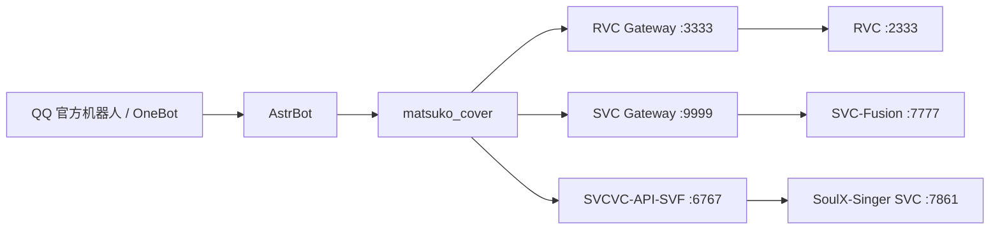

# astrbot_plugin_matsuko_cover

适用于 [AstrBot](https://github.com/AstrBotDevs/AstrBot) 的 AI 翻唱插件，支持 **RVC、SVC-Fusion、SoulX-SVCVC** 三种语音转换后端，以及网易云音乐、QQ 音乐、本地音频和 LLM 工具调用。

> 当前版本：**v2.13.0**
>
> 许可证：**GNU AGPL-3.0**
>
> 本项目基于 [CCYellowStar2/astrbot_plugin_rvc_svc](https://github.com/CCYellowStar2/astrbot_plugin_rvc_svc) 扩展。

## 功能

| 功能 | RVC | SVC-Fusion | SoulX-SVCVC |
|---|:---:|:---:|:---:|
| 网易云 / QQ 音乐点歌 | ✅ | ✅ | ✅ |
| 本地音频翻唱 | ✅ | ✅ | ✅ |
| LLM 智能点歌 | ✅ | ✅ | ✅ |
| 模型/音色列表和别名 | ✅ | ✅ | ✅ |
| 自动升降调 | ✅ | ✅ | ✅ |
| 推理进度发送到 QQ | ✅ | ✅ | ✅ |
| 参数级结果缓存 | 由中间层提供 | 由中间层提供 | ✅ |
| 零样本参考音色 | ❌ | ❌ | ✅ |
| 固定/随机种子 | ❌ | ❌ | ✅ |

其他能力：

- 搜索、选歌、选模型、推理和发送结果的完整工作流。
- 自动识别 QQ 官方机器人，使用原生按钮选歌、选音色、翻页和取消；按钮不可用时发送完整文字菜单。
- QQ 音乐风控重试与可选第三方 VIP 播放地址 API。
- RVC/SVC 的 F0、检索率、混响、延迟、人声/伴奏音量等参数。
- MSST 模型列表、默认分离模型切换和分离质量参数。
- 翻唱任务查询、取消、批量翻唱、用户偏好和统计。
- `/查看翻唱缓存 [all|rvc|svc|svcvc]` 查看各后端缓存占用；管理员可用 `/清理翻唱缓存 [...]` 安全清理。
- 取消任务会同步取消插件协程和 Gradio 推理任务，不再只隐藏任务状态。
- QQ 语音发送失败时自动继续尝试发送音频文件。
- 默认关闭旧版 EQ/压缩/混响人声后处理，避免重复处理损伤音质；需要旧音色时可开启 `vocal_postprocess`。

## 架构


```mermaid
flowchart LR
    QQ[QQ 官方机器人 / OneBot] --> AstrBot
    AstrBot --> Plugin[matsuko_cover]
    Plugin --> RVCAPI[RVC Gateway :3333]
    Plugin --> SVCAPI[SVC Gateway :9999]
    Plugin --> SVCVC[SVCVC-API-SVF :6767]
    RVCAPI --> RVC[RVC :2333]
    SVCAPI --> SVC[SVC-Fusion :7777]
    SVCVC --> SoulX[SoulX-Singer SVC :7861]
```

插件负责聊天交互、歌曲搜索/下载、参数选择和结果发送；中间层负责人声分离、缓存、后处理及调用实际推理引擎。

## 安装

将仓库克隆到 AstrBot 的插件目录：

```bash
cd AstrBot/data/plugins
git clone https://github.com/sdfsfsk/matsuko_cover.git astrbot_plugin_matsuko_cover
pip install -r astrbot_plugin_matsuko_cover/requirements.txt
```

随后重启 AstrBot，并在 WebUI 的插件配置中启用需要的后端。

依赖：

```text
gradio_client
aiohttp
qqmusic-api-python
```

## QQ 官方机器人交互

在 WebUI 的本插件配置中，默认开启 **“自动识别 QQ 官方机器人并使用 Markdown 卡片”**（`qq_official_cards=true`）与 **“自动识别 QQ 官方机器人并启用交互按钮”**（`qq_official_buttons=true`）。插件根据 `qq_official` / `qq_official_webhook` 自动选择官方消息协议，不需要另填 AppID 或密钥。

根据官方 [Markdown 消息文档](https://bot.q.qq.com/wiki/develop/api-v2/server-inter/message/type/markdown.html) 的 2026-04-23 更新，**QQ群和单聊已开放自定义 Markdown，无需单独申请模板**；频道场景仍需账号开通对应能力。卡片使用标题、加粗序号、分隔线和状态字段，歌曲名与模型名会单独转义，避免特殊字符破坏布局。

使用 `/rvc`、`/svc`、`/svcvc` 或 QQ 音乐的 `/qqrvc`、`/qqsvc`、`/qqsvcvc` 点歌时：

1. 机器人在一条消息中展示歌曲列表、选择按钮和操作说明。
2. 选歌后展示模型/参考音色列表及对应按钮。
3. 选定音色后，使用原有后端执行翻唱并发送结果。

每页显示 8 个选项，超过一页时可用 **上一页 / 下一页** 按钮浏览，也可直接发送全局序号；**取消**按钮或文字“取消”会结束当前选择。每次翻页后重新开始配置的选择等待时间（`timeout`）。

回调按钮点击后直接执行选择，不会向聊天框填入指令，也不需要再发送确认。手动输入序号仍兼容当前会话的唤醒前缀，例如 `#1`。

| 场景 | 按钮行为 |
|---|---|
| QQ 官方机器人单聊 | 点击回调按钮直接选择，无需发送消息 |
| QQ 官方机器人群聊/频道 | 点击回调按钮直接选择；手动输入序号时通常需要 @机器人 |
| 旧 WebSocket 连接尚未订阅回调 | 保留卡片，临时使用自动发送指令按钮，点击后无需手动确认 |
| 关闭按钮开关，或按钮请求失败 | 保留 Markdown 卡片，通过序号、上一页、下一页、取消继续操作 |
| 关闭卡片开关，或 Markdown 请求失败 | 发送完整的文字菜单 |
| OneBot（aiocqhttp） | 保留合并转发菜单，并支持相同的文字选择操作 |

选择菜单优先使用官方的**回调按钮**（`action.type=1`），通过 SDK 的 `INTERACTION_CREATE` 事件处理点击。收到点击后先调用互动响应接口确认，再执行选择或翻页，避免客户端一直等待。按钮权限限定为点歌者，插件同时校验会话、用户和本次菜单标识；旧菜单按钮不会误选到新一轮歌曲或音色。

旧连接尚未订阅互动事件时，菜单临时使用 `action.type=2`、`enter=true` 的指令按钮，QQ 客户端自动发送带本次菜单标识的选择命令。它会产生一条聊天消息，但无需再点发送确认；不支持自动发送的旧客户端仍可手动输入序号。该行为依据官方[发送单聊消息的 Action 字段](https://bot.q.qq.com/wiki/develop/api-v2/autogen/api/v2_users_user_openid_messages.post.html)。

可使用以下卡片入口：

| 入口 | 展示内容 |
|---|---|
| `/翻唱帮助` | 翻唱用法，以及音色刷新、任务、统计快捷按钮 |
| `/rvc`、`/svc`、`/svcvc` 及对应 QQ 音乐命令 | 无参数时展示用法卡片；点歌时展示歌曲选择、音色选择和开始翻唱卡片 |
| `/刷新rvc模型`、`/刷新svc模型`、`/刷新svcvc音色` | 音色列表卡片 |
| `/列出msst模型`、`/列出svcvc分离模型` | 分离模型列表卡片；管理员切换成功后也显示结果卡片 |
| `/查看翻唱缓存`、`/清理翻唱缓存` | 缓存统计或清理结果卡片，保留原有管理员权限 |
| `/查看翻唱任务`、`/取消翻唱任务`、`/我的翻唱统计` | 状态、取消结果或个人统计卡片 |
| 本地音频翻唱 | 开始处理与完成结果卡片 |

帮助与任务卡片中的快捷按钮属于自动发送指令按钮，命令仍经过 AstrBot 的权限和插件开关检查。音频结果仍通过原有语音/文件通道发送。按钮发送失败时先重试无按钮卡片，Markdown 也失败时再发送文字，避免列表消失。

原生按钮能否展示取决于机器人账号具备的消息能力及 QQ 客户端版本。插件不会把按钮请求失败当成发送成功，而会显示文字菜单供继续操作。参考官方[消息发送与键盘字段](https://bot.q.qq.com/wiki/develop/api-v2/autogen/api/v2_users_user_openid_messages.post.html)和[消息交互说明](https://bot.q.qq.com/wiki/develop/api-v2/server-inter/message/trans/overview.html)。

**要使用不产生聊天消息的回调选择，升级后请重启一次 QQ 官方机器人平台连接或 AstrBot**：插件需要在连接建立前增加 `INTERACTION (1<<26)` 订阅，仅重载插件不能让已建立的旧连接新增订阅。v2.13.0 起，尚未重连也可以看到卡片，并使用自动发送按钮继续选择。Webhook 模式还需在 QQ 开发者后台订阅互动事件。

回调接收逻辑由插件绑定到 QQ SDK 实例，无需改动 AstrBot 框架或第三方依赖。插件卸载时恢复已有事件处理函数；其他插件的回调事件继续交给原处理函数。

插件会区分互动确认用的 `d.id` 与发送后续消息用的 `event_id`，不把点击事件伪装成用户消息 ID。回调回复使用独立的 SDK 包装，不修改共享客户端的普通消息请求。重复事件仅确认、处理一次；其他用户、跨群/跨机器人点击以及过期按钮会被拒绝。

重启后请重新发起点歌，旧版菜单不能继续使用。

## 后端准备

### 中间层源码下载

旧版 README 中的百度网盘整合包不再作为主要下载入口，请直接使用以下公开项目：

| 项目 | 中间层端口 | 上游依赖 | 人声分离 | 适合场景 |
|---|---:|---|---|---|
| [RVCSVC-API-amd](https://github.com/sdfsfsk/RVCSVC-API-amd) | `3333` / `9999` | RVC `2333` / SVC-Fusion `7777` | UVR5 / HP5 | 环境较轻、兼容范围较广 |
| [RVCSVC-API-MSST](https://github.com/sdfsfsk/RVCSVC-API-MSST) | `3333` / `9999` | RVC `2333` / SVC-Fusion `7777` | BS-Roformer / MSST | 更高分离质量、显存需求更高 |
| [SVCVC-API-SVF](https://github.com/sdfsfsk/SVCVC-API-SVF) | `6767` | SoulX-Singer SVC `7861` | SoulX / 内置 MSST / 不分离 | 零样本参考音色转换 |

> [!CAUTION]
> **完整推理方案仅支持 Windows AMD 显卡（A 卡），NVIDIA、Intel GPU 和纯 CPU 环境不在支持范围内。** `RVCSVC-API-amd` 与 `RVCSVC-API-MSST` 使用相同的 3333/9999 端口，只需选择其中一个，不能同时启动；`SVCVC-API-SVF` 使用 6767 端口，可以与前两者之一同时运行，但还需要应用 AMD 补丁的 SoulX-Singer 上游。

公开仓库只包含源码和环境安装脚本，不包含已安装的 Python/ROCm 运行时、UVR5/MSST 权重、RVC/SVC/SoulX 模型、私人参考音色或歌曲缓存。请按照各项目 README 准备环境、上游引擎和分离模型；SVCVC 的内置 MSST 权重下载链接、SHA-256 和放置路径已写在 [SVCVC-API-SVF README](https://github.com/sdfsfsk/SVCVC-API-SVF#msst-模型下载)。

### RVC

- 插件默认中间层：`http://127.0.0.1:3333/`
- 从 [RVCSVC-API-amd](https://github.com/sdfsfsk/RVCSVC-API-amd) 或 [RVCSVC-API-MSST](https://github.com/sdfsfsk/RVCSVC-API-MSST) 选择一个中间层。
- 启动 RVC 上游和所选中间层。
- 使用 `/刷新rvc模型` 读取模型列表。

### SVC-Fusion

- 插件默认中间层：`http://127.0.0.1:9999/`
- 从 [RVCSVC-API-amd](https://github.com/sdfsfsk/RVCSVC-API-amd) 或 [RVCSVC-API-MSST](https://github.com/sdfsfsk/RVCSVC-API-MSST) 选择一个中间层。
- 启动 SVC-Fusion 上游和所选中间层。
- 兼容补丁参考：[sdfsfsk/SVC-Fusion-fix](https://github.com/sdfsfsk/SVC-Fusion-fix)
- 使用 `/刷新svc模型` 读取模型列表。

### SoulX-SVCVC

SoulX-SVCVC 使用参考音频进行零样本音色转换，不需要训练 `.pth` 音色模型。

- 中间层：[sdfsfsk/SVCVC-API-SVF](https://github.com/sdfsfsk/SVCVC-API-SVF)
- Windows AMD ROCm 补丁：[sdfsfsk/SoulX-Singer-AMD-Patch](https://github.com/sdfsfsk/SoulX-Singer-AMD-Patch)
- 插件默认中间层：`http://127.0.0.1:6767/`
- SoulX-Singer SVC 上游：`http://127.0.0.1:7861/`
- 目标歌曲分离：`soulx`（默认、由上游分离）、`msst`（中间层内置 BS-Roformer）或 `none`（直接交给 SoulX）。
- `msst` 模式需要完整的 `SVCVC-API-SVF/runtime-rocm/` 和模型权重；下载后无需依赖相邻的 `RVCSVC-API-MSST` 目录。

启动顺序：

1. 启动 SoulX-Singer，选择 `SVC voice conversion`，等待 7861 就绪。
2. 启动 SVCVC-API-SVF，等待 6767 就绪。
3. 在插件配置中开启 `enable_svcvc`。
4. 使用 `/刷新svcvc音色`。

若选择 `msst` 并开启“自动混回伴奏”，请使用带 `soulx_svc_convert_external_acc_path` 接口的 AMD 补丁版 SoulX-Singer；中间层会在分离前检查该接口，缺失时会立即提示而不浪费整首歌的分离时间。

参考音色放入 SVCVC-API-SVF 的 `voice_profiles/`。支持 WAV、FLAC、MP3、OGG、M4A 和 AAC；文件名默认作为音色 ID，也可添加同名 JSON：

```json
{
  "profile_id": "my_voice",
  "display_name": "示例音色",
  "description": "干净、无伴奏的参考演唱",
  "prompt_vocal_sep": false
}
```

建议使用 5～30 秒、单人、无伴奏、低混响的干净音频。新增音色后需要重启或刷新中间层的 Gradio 音色选项，再执行插件刷新命令。

## 常用配置

| 配置 | 默认值 | 说明 |
|---|---:|---|
| `rvc_base_url` | `http://127.0.0.1:3333/` | RVC 中间层 |
| `svc_base_url` | `http://127.0.0.1:9999/` | SVC-Fusion 中间层 |
| `svcvc_base_url` | `http://127.0.0.1:6767/` | SoulX-SVCVC 中间层 |
| `enable_rvc` | `true` | 启用 RVC |
| `enable_svc` | `true` | 启用 SVC-Fusion |
| `enable_svcvc` | `false` | 启用 SoulX-SVCVC |
| `enable_qqmusic` | `true` | 启用 QQ 音乐 |
| `disable_netease` | `false` | 禁用网易云点歌 |
| `enable_progress_bar` | `true` | 将后端进度发到聊天 |
| `progress_update_interval` | `3` | 进度消息最小间隔（秒） |
| `enable_send_file` | `false` | 除 QQ 语音外再发送文件 |
| `inference_timeout` | `300` | 推理超时（秒） |
| `llm_force_mode` | `false` | 禁用手动命令，只允许 LLM 工具 |

SoulX 在 AMD 上处理长歌曲时建议把 `inference_timeout` 和任务超时提高到 `9000` 秒。

### SoulX 参数

| 配置 | 默认值 | 说明 |
|---|---:|---|
| `svcvc_prompt_vocal_sep` | `false` | 是否分离参考音频 |
| `svcvc_target_separation` | `soulx` | 目标分离方式：`soulx` / `msst` / `none` |
| `svcvc_auto_shift` | `true` | 自动匹配音域 |
| `svcvc_auto_mix_acc` | `true` | 自动混回伴奏 |
| `svcvc_pitch_shift` | `0` | 指定变调，范围 -36～36 |
| `svcvc_n_step` | `32` | 采样步数，越高通常越慢 |
| `svcvc_cfg` | `1.0` | CFG 系数 |
| `svcvc_seed` | `42` | 固定种子（0–4294967295） |
| `svcvc_random_seed` | `false` | 每次使用随机种子 |

固定种子且其他参数一致时可以命中持久缓存；开启随机种子后，SVCVC-API-SVF 默认不会读取或写入持久缓存。

## 命令

### 模型和后端

| 命令 | 说明 |
|---|---|
| `/刷新rvc模型` | 刷新 RVC 模型 |
| `/刷新svc模型` | 刷新 SVC-Fusion 模型 |
| `/刷新svcvc音色` | 刷新 SoulX 参考音色 |
| `/列出msst模型` | 查看 MSST 分离模型 |
| `/切换msst模型 <序号或名称>` | 切换 MSST 分离模型 |
| `/列出svcvc分离模型` | 查看 SVCVC-API-SVF 内置的 MSST 分离模型及当前选择 |
| `/切换svcvc分离模型 <序号或名称>` | 切换并持久化 SVCVC-API-SVF 的 MSST 分离模型（管理员） |
| `/设置rvc后端链接 <URL>` | 修改 RVC 中间层地址（管理员） |
| `/设置svc后端链接 <URL>` | 修改 SVC 中间层地址（管理员） |
| `/设置svcvc后端链接 <URL>` | 修改 SVCVC 中间层地址（管理员） |

### 点歌

| 命令 | 说明 |
|---|---|
| `/rvc <歌名> [升降调]` | RVC + 网易云点歌 |
| `/svc <歌名> [升降调]` | SVC-Fusion + 网易云点歌 |
| `/svcvc <歌名> [升降调]` | SoulX-SVCVC + 网易云点歌 |
| `/qqrvc <歌名> [升降调]` | RVC + QQ 音乐 |
| `/qqsvc <歌名> [升降调]` | SVC-Fusion + QQ 音乐 |
| `/qqsvcvc <歌名> [升降调]` | SoulX-SVCVC + QQ 音乐 |
| `/qq点歌 <关键词>` | 只搜索 QQ 音乐 |
| `/本地翻唱` | 使用最近上传/缓存的本地音频 |

### 任务

| 命令 | 说明 |
|---|---|
| `/查看翻唱任务` | 查看当前任务状态 |
| `/取消翻唱任务` | 请求取消当前任务 |
| `/我的翻唱统计` | 查看个人翻唱统计 |

如果启用了 `llm_force_mode`，上述手动命令会被禁用，请直接通过自然语言要求机器人点歌。

## LLM 工具

插件提供以下主要 Function Calling 工具：

- `search_music`：搜索网易云或 QQ 音乐。
- `rvc_cover`：使用 RVC 翻唱。
- `svc_cover`：使用 SVC-Fusion 翻唱。
- `svcvc_cover`：使用 SoulX 参考音色翻唱。
- `smart_cover`：自动完成搜索、选歌、模型匹配和翻唱。
- `batch_cover`：批量翻唱。
- `get_available_models`：读取三种引擎的模型/音色列表。
- `cover_absolute_path_audio`：处理本地绝对路径音频。
- `cover_local_audio`：处理用户上传的音频。
- `get_task_status` / `cancel_cover_task`：查询或取消任务。

示例：

```text
用甘城喵音色从 QQ 音乐翻唱《起风了》
用 RVC 第 2 个模型翻唱《晴天》，升 2 调
列出现在可用的 SoulX 参考音色
```

## 进度、缓存和结果发送

- 支持接收 Gradio 的下载、人声分离、F0、逐段推理、混音和导出进度。
- `progress_update_interval` 控制聊天提示频率，避免刷屏。
- 中间层返回 `cache_hit` 时，插件会提示缓存命中并直接发送结果。
- 默认先发送 QQ 语音；语音发送失败时无论 `enable_send_file` 是否开启都会继续发送音频文件，避免结果丢失。
- QQ 音乐由插件先下载到本地，再提交给中间层；网易云歌曲可由对应中间层直接处理。

## 常见问题

### 无法连接后端

确认对应端口正在监听，并检查插件配置中的 URL。SVCVC 必须先启动 SoulX 7861，再启动中间层 6767。

### 新增 SVCVC 音色后转换提示“不在 choices 中”

请升级 SVCVC-API-SVF v1.2.0 或更高版本，再执行 `/刷新svcvc音色`。新版下拉框允许动态音色 ID，并提供 WebUI 刷新按钮，无需重启。

### SoulX 推理完成但机器人没有收到文件

请使用带 `/soulx_svc_convert_path` 接口的 AMD 补丁和最新版 SVCVC-API-SVF；该接口避免在同一台机器上通过 Gradio 重复下载大型 WAV。

### QQ 音乐无法获取播放地址

普通歌曲优先使用 QQ 音乐接口。VIP/付费歌曲可选配置 `third_party_api_key`；默认值为空，仓库不包含任何 API 密钥。频繁触发风控时可调整重试设置。

### SoulX 无法命中缓存

检查 `svcvc_random_seed` 是否关闭。歌曲内容、参考音色、种子、采样步数、CFG、升降调或模型资产变化都会生成新的缓存键。


## 安全与版权

- 不要把私人音色、歌曲、生成结果、Cookie 或 API Key 提交到公开仓库。
- 使用者应确保对参考音频、歌曲和生成内容拥有相应授权，并遵守所在地区法律及平台规则。
- 本插件和相关模型可能产生模仿特定人物的声音，请勿用于冒充、欺骗、骚扰或其他侵权行为。

## 许可证

本仓库使用 [GNU Affero General Public License v3.0](LICENSE)。第三方项目、模型、音乐和 API 分别受其自身许可证及服务条款约束。

## 致谢

- [AstrBot](https://github.com/AstrBotDevs/AstrBot)
- [CCYellowStar2/astrbot_plugin_rvc_svc](https://github.com/CCYellowStar2/astrbot_plugin_rvc_svc)
- [RVC-Project/Retrieval-based-Voice-Conversion-WebUI](https://github.com/RVC-Project/Retrieval-based-Voice-Conversion-WebUI)
- [Soul-AILab/SoulX-Singer](https://github.com/Soul-AILab/SoulX-Singer)
- [svc-develop-team/so-vits-svc](https://github.com/svc-develop-team/so-vits-svc)
- [Anjok07/ultimatevocalremovergui](https://github.com/Anjok07/ultimatevocalremovergui)
